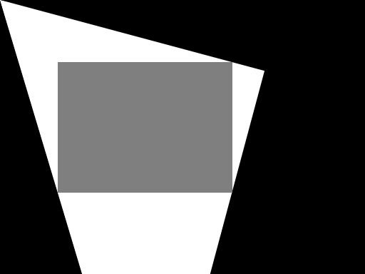

# QRec

**QRec** is an algorithm that helps you **quickly** find the **largest fixed-aspect, axis-aligned rectangle** that can be **inscribed** in **any given polygon**.

## Quick Start

Run '**python main.py**' to find the rectangle that suits the polygon constructed from several homographies.

## Algorithm 

A largest inscribed rectangle ($R$) should have at least one conner alined to the edgd of the given polygon ($M$). Before the start, edges of the given polygon is calculated with [Canny Edge Algorithm](https://docs.opencv.org/4.x/da/d22/tutorial_py_canny.html), that is, $E =canny(M)$, where notation $E$ representing the list of points in the edge dected by canny edging. Items in $E$ is shuffled to break the original order, increasing the randomness for later searches.

Searching process interates over the size of the rectangle. For each size of $[H_i, W_i]$, four rectangles are tested based on the edge set $E$. Specifically, for each point $[x_j, y_j]$ in $E$, we test the region of $[H_i\pm x_j, W_i\pm y_j]$. The size of $[H_i, W_i]$ will be accepted once there exists a region inscribed in $M$.

Searching will not end until there is a size with which no inscribed rectangle is found.

## Results

